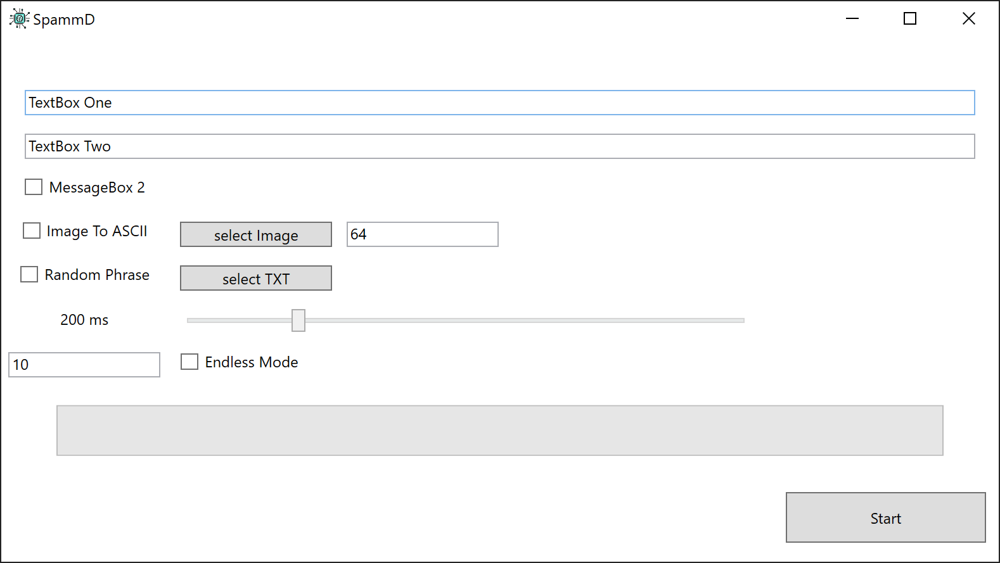

# SpammD
This application is a program intended to act as a chat spammer application built in WPF as further practice of requiring multiple threads for graphics functions to correctly process in WPF, as well as to demonstrate a new and evolved model for chat spamming applications.

## Prerequisites
This program requires no prerequisites.

## Built With
This program was built with the base C# system libraries as well as the WindowsInput library available on NuGet.

## Authors
* **Shaan Khan** - *All Work*

## License
This project is licensed under the Mozilla Public License 2.0 - see the [LICENSE](https://github.com/ShaanCoding/SpammD/blob/master/LICENSE) files for details
